<!-- Header -->

<p align="center">
  
</p>

<h3 align="center">
  AI Systems Engineer · Agent Platform Architect
</h3>

<p align="center">
  Agent Runtime · Enterprise RAG · Model Serving · AI-Driven Engineering
</p>

<p align="center">
  Building production-oriented AI systems across models, knowledge, tools, infrastructure, and software delivery.
</p>

<p align="center">
  <a href="https://study.meowcoder.com">
    
  </a>
  <a href="mailto:tc3oliver@gmail.com">
    
  </a>
  
</p>

---

## About

I am a Senior AI Engineer and System Architect based in Taiwan.

I design and build AI platforms that connect language models, enterprise knowledge, engineering tools, inference infrastructure, and software development workflows.

My work focuses on turning AI prototypes into systems that are deployable, measurable, permission-aware, and maintainable.

My engineering background spans system architecture, backend services, web and mobile applications, cloud infrastructure, DevOps, information security, and machine learning system integration.

---

## AI Engineering Focus

### Agent Platforms

* Stateful agent workflows and multi-agent orchestration
* Tool calling, MCP, structured output, and permission control
* Execution tracing, checkpoints, retries, and failure recovery

### Enterprise Knowledge

* RAG, hybrid retrieval, reranking, and knowledge graphs
* Code, specification, and cross-repository knowledge integration
* Citation grounding, source validation, and retrieval evaluation

### Model Infrastructure

* vLLM, ROCm, and OpenAI-compatible model gateways
* Model routing, quantization, KV cache, and memory optimization
* Latency, throughput, concurrency, and capacity analysis

### AI-Driven Engineering

* AI code review, agentic coding, and CI/CD integration
* Agent evaluation, regression testing, and observability
* Runtime security, audit trails, and policy-controlled tool execution

---

## AI Platform Architecture

```text
Applications and Engineering Workflows
                  │
                  ▼
        Agent Runtime Platform
                  │
       ┌──────────┼───────────┐
       ▼          ▼           ▼
  Knowledge     Tools      Evaluation
  Retrieval     and MCP    and Tracing
       │          │           │
       └──────────┼───────────┘
                  ▼
       Model Gateway and Router
                  │
       ┌──────────┴───────────┐
       ▼                      ▼
 Local Inference        Hosted Models
 vLLM / ROCm            API Providers
```

The platform boundary keeps models, retrieval systems, tools, policies, and evaluation components independently replaceable.

---

## Core Technologies

<p>
  
  
  
  
  
  
  
  
  
  
  
  
  
  
  
  
  
</p>

<details>
  <summary><strong>Additional Engineering Experience</strong></summary>
  <br/>

* **Architecture:** REST, gRPC, API gateways, authentication, RBAC, and asynchronous services
* **Infrastructure:** Docker, AWS ECS, Terraform, monitoring, and automated deployment
* **Data:** PostgreSQL, SQL Server, Redis, vector databases, and graph databases
* **Applications:** Vue, React, PWA, Flutter, native iOS, and native Android
* **Engineering:** Static analysis, testing, observability, security controls, and release governance

</details>

---

## Technical Writing

I publish research notes and technical analysis on:

* AI agent architecture and runtime engineering
* Enterprise RAG and knowledge systems
* Model inference and serving optimization
* Agent security and runtime governance
* AI-assisted software development
* Software architecture and engineering automation

<p>
  <a href="https://study.meowcoder.com">
    
  </a>
</p>

---

## GitHub Activity

<p align="center">
  
</p>

---

## Engineering Principles

> Models are replaceable. Runtime boundaries and evaluation loops are architecture.

AI systems should remain:

* **Traceable** — decisions, sources, and execution paths can be inspected
* **Testable** — retrieval, routing, tools, and outputs can be regression-tested
* **Replaceable** — models and providers remain interchangeable
* **Permission-aware** — tool access follows explicit runtime policies
* **Observable** — quality, latency, cost, usage, and failures remain measurable
* **Recoverable** — workflows support retries, checkpoints, and controlled failure

<p align="center">
  
</p>
